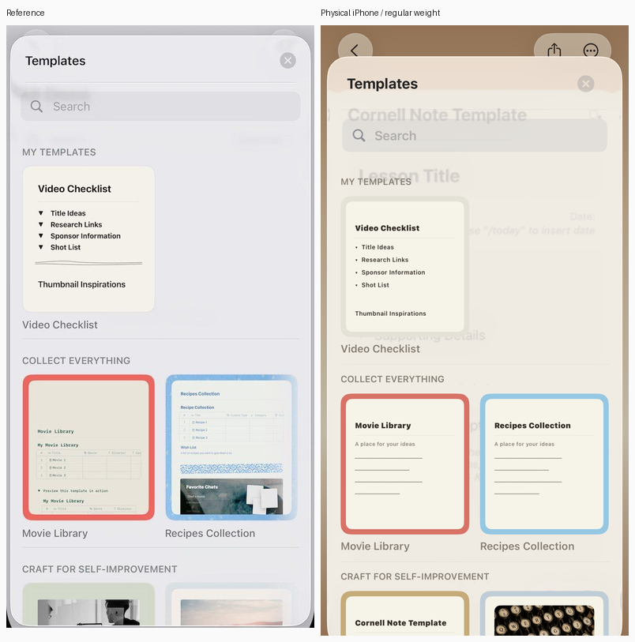
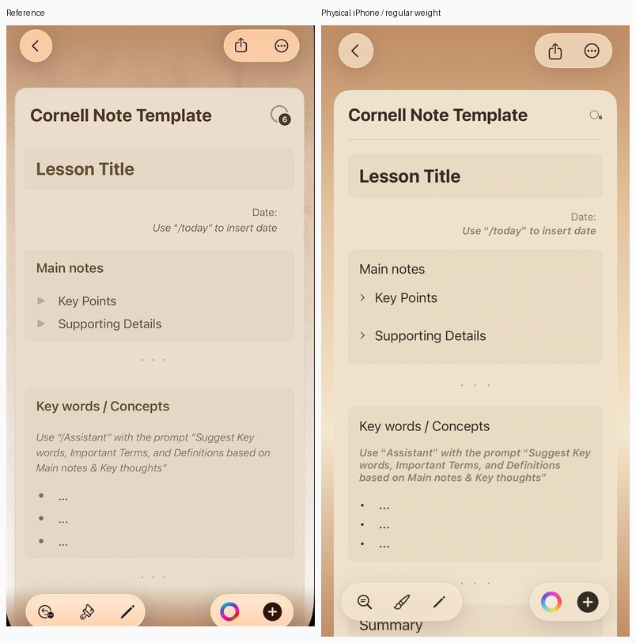
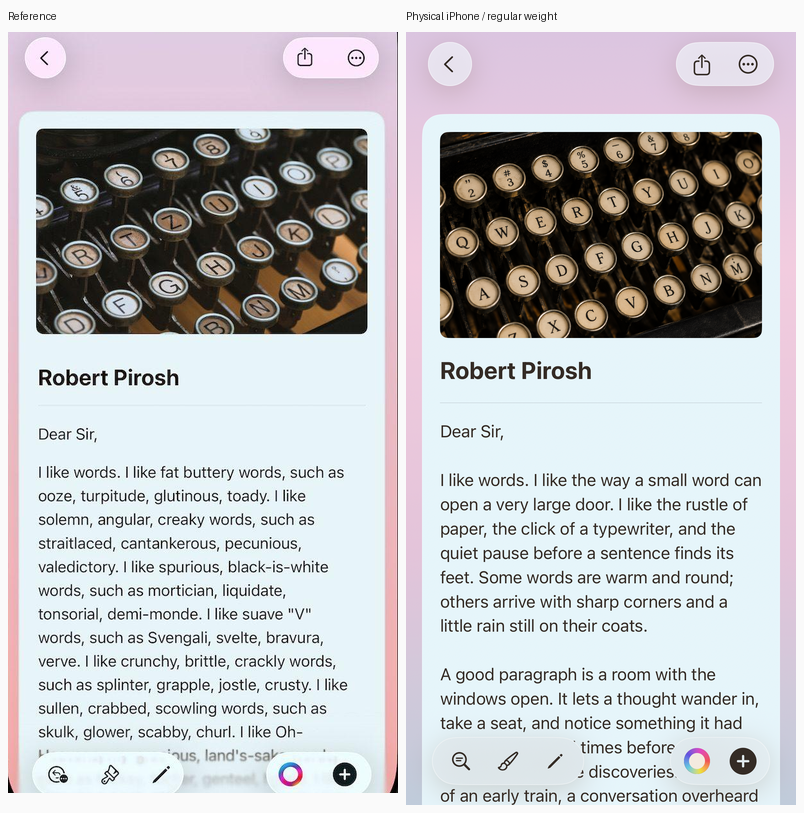

# Note example acceptance

Bonsai Note runs the `note` OCaml/Bonsai entrypoint through the shared
BonsaiSwiftUI renderer. Its Swift application source only opens that entrypoint.
The example uses deterministic in-memory fixtures and a bundled original
image; it has no storage, network service, export, or account workflow.

## Material correction

The original comparison exposed a flat, opaque Templates panel. On the physical
iPhone, the `.large` detent hid the backdrop even with native SwiftUI Material.
Changing the actual document from warm to cool left the sampled sheet RGB
unchanged at [240, 240, 242]. Xcode's system screenshot confirmed the same result.

The correction uses standard SwiftUI APIs: `Fraction 0.98` maps to
`.presentationDetents([.fraction(0.98)])`, preserving the inset floating sheet;
Surface uses a clear presentation backing and one `.ultraThinMaterial` layer
at 40% opacity and zero tint alpha.
No custom UIKit blur, view-hierarchy mutation, or simulated screenshot background
is used. [The cool-backdrop capture](screenshots/swiftui-note/templates-cool.png)
shows the same sheet over the alternate document theme. The unfocused physical
regression measures a 15-level RGB response when the real document changes
theme, and the comparison shows the
blurred backdrop and soft rounded edge. The earlier visual-completion claim was
premature; this correction addresses the material issue specifically.

Search editing retains native keyboard avoidance. On iOS 26, the sheet grows
when the software keyboard appears and its full-height background becomes
opaque. This is system presentation behavior, documented in Apple's
[SwiftUI design session](https://developer.apple.com/videos/play/wwdc2025/323/)
and [sheet keyboard-avoidance session](https://developer.apple.com/videos/play/wwdc2021/10063/).
Surface opacity controls the decorative layer; it does not override that system
background. Experimental keyboard-dependent detents and presentation lifecycle
changes were removed. Acceptance checks retained search focus and the return
of the translucent material after keyboard dismissal, and records the focused
backdrop response without requiring transparency in that system state.

[Focused search](screenshots/swiftui-note/templates-focused.png) and
[after keyboard dismissal](screenshots/swiftui-note/templates-after-keyboard.png)
show these two states. The separate OS keyboard window is excluded from these
window captures; its visible intersection is checked from UIKit's frame event.

## Physical reference evidence

The September 15, 2026 acceptance device is an iPhone 13 (iPhone14,5), iOS
26.6.1 (23G83), with a 390 × 844 point window at 3× scale. Xcode is 26.1.1
(17B100). Both the signed Release application and the Debug acceptance host
link the same verified iOS 18 arm64 OCaml complete object.

[Capture metadata](screenshots/swiftui-note/evidence.json) records the source
revision, exact source and object hashes, device settings, fixture states and
crop coordinates. The implementation is uncommitted; the source hashes identify
its changes beyond the recorded base commit.

The images below are crops of actual onscreen `UIWindow.drawHierarchy` captures.
They are not offscreen component renders. The comparison tool only crops and
resizes each app-content panel to 390 pixels wide with its aspect ratio intact.
System indicators and device hardware are excluded from the comparison area.
The supplied reference photograph includes slight perspective distortion.

The phone has Bold Text enabled. The acceptance host first captures that
system setting, then sets its SwiftUI window's legibility weight to regular for
reference comparisons. It also tests large text in a 320-point content width.
The standalone application follows the user's accessibility text settings.
The native search field continues to use UIKit's preferred input font.

### Templates



The fixed heading/search region now has a fine divider, a single gray search
surface and a pale close control. Empty search has no clear button. The native
sheet uses one ultra thin material background at 40% opacity over a clear
presentation backing. Category headings, portrait previews and the
colored two-column catalog scroll independently beneath the header.

The catalog contains representative mock previews rather than exact copies of
the reference documents. Current iOS owns the fractional sheet's inset placement
and native presentation behavior. Its tint responds to the actual warm or cool
document underneath, while the reference has a neutral backdrop. Radius, tint
and outline come from the public Surface API. These remaining differences are
visible in the comparison and are not a claim of pixel-for-pixel equivalence.

### Cornell



The warm gradient, cream paper, inset sections, trailing date hint, italic
helper text, dot separators and independent disclosures preserve the reference
hierarchy. Both disclosures start collapsed. The rows keep 44-point targets;
this makes their vertical spacing more generous than the reference photograph.
The small count ornament is decorative, with no invented product behavior.

### Reading



The cool page uses a real bundled typewriter image, an explicit crop, a bold
Robert Pirosh heading, a divider and long English prose. The cover-to-title gap
and text sizes were tuned from normalized device captures. The original image
and prose differ from the reference as permitted by the agreed mock scope;
see [asset provenance](../examples/note/ASSETS.md).

Both documents use native material capsules, shared gradients, rounded surfaces,
shadows and borders. Tool symbols represent named mock actions. No unidentified
reference icon is treated as an AI or collaboration requirement.

## Verified behavior

`native/test/note_device.swift` mounts the actual Note entrypoint in a visible
physical-device window. It activates retained native button/menu handlers,
sends UIKit editing events, moves the actual scroll view, and checks the
resulting OCaml-rendered tree. It does not reproduce Note's model in Swift.

The physical acceptance verifies:

- Initial Cornell presentation and 44-point Back, Share and Edit targets.
- Translucent sheet response to the real warm and cool document backdrops.
- Search focus with the visible software keyboard, and material restoration
  after leaving editing.
- Native search, empty results, clear and selection of the reading fixture.
- Scrolling to the final content above the anchored bottom controls.
- Back, close and the native presentation dismissal callback preserving the note.
- Independent disclosure expansion and collapse.
- Native title/body input, Unicode, Done and retained edits.
- Theme selection, both insertions, Share preview and Word count preview.
- Fresh template seeds after edits and insertion.
- A 320-point viewport with no horizontal scroll overflow, and content growing
  when Dynamic Type changes from Large to Accessibility 2.
- A real software keyboard with the editor and Done above its top edge.

[Keyboard capture](screenshots/swiftui-note/editing-keyboard.png),
[end-of-document capture](screenshots/swiftui-note/reading-end.png),
[narrow capture](screenshots/swiftui-note/narrow.png), and
[large-text capture](screenshots/swiftui-note/narrow-large-text.png) accompany
the exact measurements in the metadata. Window captures exclude the keyboard's
separate system window; its frame is measured from the UIKit notification.

XCTest UI automation failed twice before executing any test: the device test
manager refused its bootstrap channel and the runners exited with status 74.
The failure bundles remain in `_build/validation/note-ios-acceptance.xcresult`
and `_build/validation/note-ios-ui-retry.xcresult`. This report does not claim
that those XCTest UI tests passed. The separate device host supplies the actual
application, input, layout and screenshot evidence described above. Finger-driven
system gestures and the OS keyboard candidate window are not automated by it.

## Material correction validation

- OCaml build and test suite: passed, including fractional detent validation.
- Focused Swift sheet/surface tests: 17 tests in four suites passed, including
  actual native sheet input ownership, dismissal and retained content.
- Physical acceptance: eight groups passed, including the new backdrop test.
- Existing Large/Medium behavior remains native; only Note selects Fraction 0.98.

## Earlier implementation validation

- `dune build @all @install` and `dune runtest`: passed on the final sources.
  Note has seven behavior groups, including delayed input after clearing search.
- Swift full suite: 525 tests in 110 suites passed in 565.173 seconds after the
  Protocol 6 field change. After extracting the material paint path for
  accessibility verification, all five focused Surface tests passed again.
- `make protocol-check protocol-fixtures-check`: passed. The schema, generated
  IDs, native ABI version and cross-language fixtures all use Protocol 6.
- Standalone CLI packaging: passed in 58.940 seconds. It compares the bundled
  cover byte-for-byte, checks host generation, and runs the actual packaged
  OCaml startup/presentation/restart test.
- macOS Debug and signed physical-iOS Release app builds: passed. The final
  Release app was installed and launched on the iPhone.
- Manual macOS acceptance: the actual window was resized to 320 points wide;
  document controls remained visible, search kept its single surface while
  focused, and body editing plus Done preserved the text. The editor exposes
  a named `Note content` container with a settable native text-entry child.
- Physical acceptance: all seven device groups passed on the final source
  snapshot. The editor ends 16 points above the software keyboard; the final
  document content clears the bottom controls by 58 points. At 320 points wide,
  content height grows from 954.33 to 1428.67 points with larger text.
- `sh tool/test_network_ios_contract.sh`: passed, including example registration,
  generated native hosts and physical-iOS artifact checks.
- Cross-toolchain checks: concrete virtual-library iOS 18 artifacts and all five
  closure-artifact acceptance/rejection cases passed using the rebuilt target
  libraries registered in the local iOS compiler sysroot.

The aggregate `tool/test_ci_contract.sh` gate stops at nine missing generated
SDK package files under `tool/ios/opam-repository/0.1.0/packages/bonsai_swiftui_ios_*`.
Running the unchanged SDK-layering check against an isolated export of base
commit `d22bcf8b17416dbca104e6b8b7c6e59880352551` reproduces the same nine failures.
This is a pre-existing SDK publication gap; no aggregate CI pass is claimed.
The local source-built iOS compiler, libraries, object and signed app were
verified independently. Repository policy requires publishing a separate SDK
update after a future source commit and push.

## Shared capabilities

- [Decorative surfaces](swiftui-surfaces.md): Solid, Linear, Angular,
  Ultra thin, Thin and Regular material, background opacity, retained children, radius, border, shadow
  and native sheet background. Kind 8 is reserved by the standard renderer.
- [Text fields](swiftui-text-fields.md): Rounded and Plain appearance for native
  normal and secure fields. Plain removes the native container so callers can
  compose a single search surface. Changing appearance preserves the controller,
  draft and editing session. Protocol 6 replaces the previous wire layout.
- Materials use their opaque RGB tint when Reduce Transparency is enabled.
  A native paint test checks exact opaque output on red and blue backdrops in
  both color schemes. The physical phone had Reduce Transparency disabled.
- Surfaces introduce no animations. Reduce Motion needs no new animation path;
  native sheet transitions continue to follow the OS setting.

## Reproduce

Build the ordinary app and run its OCaml behavior tests from the repository root:

```sh
dune exec examples/note/test/note_example_tests.exe
python3 tool/build_swiftui_example.py note
```

For physical acceptance, first build a verified iOS 18 arm64 Note complete
object with the repository toolchain. The installed SDK must match Protocol 6.
The source-checkout build can provide the object explicitly:

```sh
python3 native/test/test_note_device.py \
  --native-object "$NOTE_IOS_OBJECT" \
  --device "$IOS_DEVICE_ID" \
  --development-team "$IOS_DEVELOPMENT_TEAM"

xcrun devicectl device copy from --device "$IOS_DEVICE_ID" \
  --domain-type appDataContainer \
  --domain-identifier org.bonsai-swiftui.test.note-device \
  --source Documents/note-acceptance --destination "$NOTE_CAPTURES"
```

Keep the phone unlocked and the acceptance host in front. It disables its idle
timer only during the run and writes `result.json`, including failures. Wait
for `status: passed` before creating comparison evidence. The standalone Note
app is a separate bundle, `org.bonsai-swiftui.example.note`.

With Pillow available, regenerate the normalized evidence:

```sh
python3 native/test/compare_note_reference.py \
  --reference "$NOTE_REFERENCE" --captures "$NOTE_CAPTURES" \
  --native-object "$NOTE_IOS_OBJECT" --output docs/screenshots/swiftui-note
```

The comparison script requires the original 2000 × 1391 reference and the
1170 × 2532 captures used by its explicit crop coordinates. It does not accept
an incomplete acceptance run.
